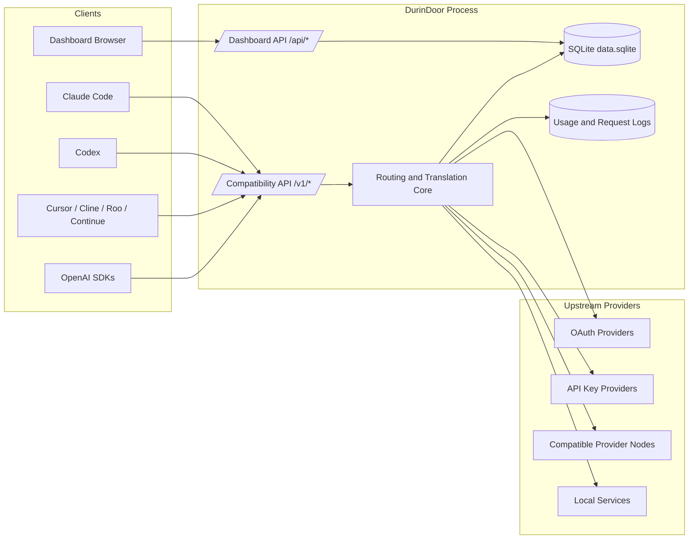
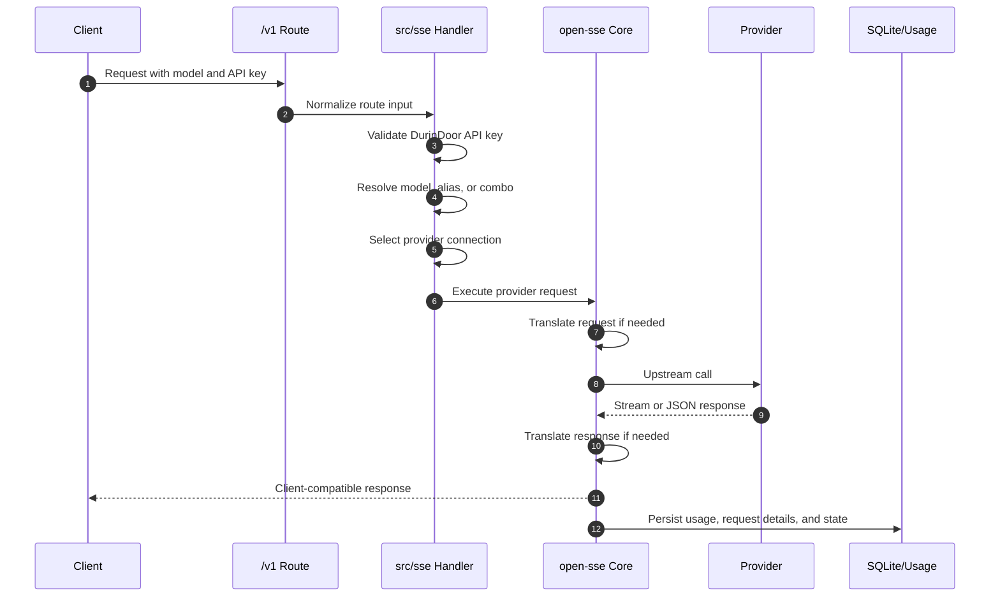

# DurinDoor Architecture

_Last updated: 2026-07-06_

DurinDoor is a Next.js-based AI gateway and dashboard. It exposes OpenAI-compatible routes, manages provider credentials, translates requests and responses across provider formats, applies account and combo fallback, and records usage in local storage.

## System Context

## Main Runtime Areas

| Area | Paths | Responsibility |
| --- | --- | --- |
| Dashboard app | `src/app/(dashboard)` | Browser UI for providers, combos, usage, endpoint setup, tools, tunnels, MITM, MCP, and settings. |
| Compatibility API | `src/app/api/v1`, `src/app/api/v1beta` | OpenAI-compatible and related client-facing routes. |
| Management API | `src/app/api/*` | Dashboard routes for providers, keys, usage, settings, tunnels, MCP, proxy pools, and OAuth. |
| Routing layer | `src/sse` | Request entry handlers, auth checks, model resolution, and service dispatch. |
| Core engine | `open-sse` | Provider execution, translation, streaming, fallback, token refresh, usage extraction, and modality cores. |
| Persistence | `src/lib/db` | SQLite driver, migrations, repositories, backups, and legacy JSON migration. |
| CLI | `cli` | Starts the app, opens dashboard, manages local settings, and integrates with tray helpers. Bundled runtime: Node 20.20.2 / npm 10.8.2. |

## Request Lifecycle

## Routing and Fallback

DurinDoor has two fallback layers:

1. Account fallback chooses another active connection for the same provider and model.
2. Combo fallback chooses the next configured model in an ordered combo chain.

A direct model request uses account fallback only. A combo request can use both layers.

A model's context window and maximum output resolve through a single function,
`resolveModelLimits` in `open-sse/providers/capabilities.js`, which reports
whether the numbers are real catalog values or the generic floor. `handleChatCore`
rejects an oversize request before dispatch instead of letting the provider
return a 400, and stays silent when the model's real limit is unknown. See
[Model Limits and Context Enforcement](reference/model-limits.md).

## Translation Layer

The translation layer converts between OpenAI, Anthropic Claude, Gemini, OpenAI Responses, Kiro, Cursor, CommandCode, Ollama, Vertex, and other registered formats. Translators are organized under `open-sse/translator` and shared format logic lives in `open-sse/translator/concerns` and `open-sse/translator/formats`.

Provider-specific stream formats are handled by executors and response translators. Tool calls, reasoning blocks, image content, and audio content need the most careful tests because not every upstream format supports the same fields.

For providers with multiple wire-format endpoints, routing selects transport from the final outbound format. A model-level `targetFormat` therefore moves translated requests to the matching endpoint, headers, and authentication scheme; unpinned models can still use a client-format endpoint directly when their registry metadata declares support.
Gemini and Antigravity request translation rewrites `OpenCode` branding in system instructions to case-matched `Antigravity` branding before provider dispatch. User and assistant message content stays unchanged.

## Persistence

The primary database is SQLite at `DATA_DIR/db/data.sqlite`. The default `DATA_DIR` remains `~/.9router` or `%APPDATA%\9router` for compatibility. Legacy JSON files may exist during migration and should be treated as migration artifacts unless the running version still reads a specific file.

## Security Surfaces

- Dashboard authentication and session cookies.
- DurinDoor API keys used by client tools.
- Upstream provider credentials and refresh tokens.
- Optional request body logging.
- Optional MITM certificate and local interception setup.
- Optional tunnels and reverse proxies.
- MCP Gateway keys and server definitions.

Production deployments should set explicit secrets, use HTTPS, restrict dashboard access, and back up encrypted or access-controlled storage.

## Extension Points

| Extension | Add or update |
| --- | --- |
| Provider registry entry | `open-sse/providers/registry` |
| Provider models and capabilities | Provider registry plus related model config files |
| Provider executor | `open-sse/executors` when the upstream is not generic compatible |
| Request or response translator | `open-sse/translator/request` and `open-sse/translator/response` |
| Dashboard provider UI | Registry display fields and dashboard components |
| Compression | [`features/compression.md`](features/compression.md) and `open-sse/services/compression` |
| Realtime | [`features/realtime.md`](features/realtime.md) and the WebSocket server |
| MCP Gateway | [`features/mcp-gateway.md`](features/mcp-gateway.md) and `src/lib/mcp` |
| API route | `src/app/api` |
| Database entity | `src/lib/db/schema.js`, migrations, and repositories |

## Documentation Source

The canonical product documentation lives directly in `docs/` as Markdown. There is no docs web app in this repository.
