# Usage and Quota Tracking

DurinDoor records request activity so operators can understand traffic, cost, provider health, and quota pressure. The exact data available depends on the provider response and the connection type.

## What DurinDoor Tracks

| Data | Description |
| --- | --- |
| Request time | When the request was handled. |
| Provider and model | The resolved upstream provider and model. |
| Connection | The account or credential used when available. |
| Input tokens | Prompt tokens reported or estimated by the upstream. |
| Output tokens | Completion tokens reported or estimated by the upstream. |
| Total tokens | Combined usage when known. |
| Cost estimate | Calculated when pricing data is available. |
| Latency | Duration of the request. |
| Status | Success, provider error, client error, retry, or fallback result. |
| Error details | Normalized error text for failed requests. |

## Dashboard Views

Use the dashboard to inspect usage from several angles:

- Overview cards for high-level usage.
- Usage charts for trends over time.
- Request logs for individual calls.
- Request details for payload and provider diagnostics when logging is enabled.
- Provider limits for quota reset and cooldown information.
- Provider topology for how traffic flows through configured providers.

## Quota Reset Windows

Providers use different quota models. DurinDoor stores and displays reset information when the provider integration exposes it.

Common reset patterns:

| Pattern | Meaning |
| --- | --- |
| Rolling window | Usage expires gradually after a fixed interval. |
| Daily reset | Quota resets at a provider-defined time each day. |
| Weekly reset | Larger allowance resets once per week. |
| Monthly reset | Billing or subscription allowance resets monthly. |
| No published quota | Provider does not expose a reliable reset model. |

Treat displayed reset windows as operational hints unless the provider explicitly guarantees them.

## Streaming Usage Translation

Response translators keep provider-specific metering fields internally while exposing only standard token fields to clients.

- Kiro usage chunks may contain `kiro_credits` and `kiro_credit_unit` alongside normal token counts. These fields are preserved in the request-local `state.usage` object for internal accounting and the final usage summary, but they are stripped from any chunk forwarded to OpenAI, Claude, or Responses API clients.
- When Kiro reports only credit information and no standard token fields, the forwarded chunk omits the `usage` property entirely instead of sending an empty object.
- Fallback token counts derived from Kiro metering or context events are marked with `estimated: true`. The `estimated` flag travels through direct routes (e.g., Kiro → Claude) so downstream consumers do not treat inferred counts as authoritative provider metrics. Only a strict boolean `true` is accepted as the marker.
- When projecting an OpenAI chat-completions usage object into the Responses API, DurinDoor merges the chunk's usage fields into the existing `state.usage` rather than replacing it. This keeps provider-only fields such as Kiro credits intact while still letting the latest public token values win.

Schema version 7 adds the runtime-neutral persistence boundary used by the quota integration program. It stores provider-reported observations separately from local request accounting:

- `providerQuotaSnapshots` keeps one current row for a stable connection, account/resource, and quota dimension.
- `quotaFetchStates` records whether the latest refresh succeeded, was missing or malformed, failed authentication, was rate-limited, timed out, or hit a network/provider error. Its `lastObservedAt` value is the durable whole-source watermark, including a successful refresh that returned an empty set.
- `usageHistory`, `usageDaily`, and API-key lifetime totals remain local accounting. Provider snapshots never absorb those counters. Schema version 8 adds a separate operational reservation ledger described below; it never decrements or rewrites provider observations.

A snapshot distinguishes `bounded`, `unlimited`, and `unknown` limits. Missing data never silently means unlimited or exhausted. Zero is a valid limit, used amount, remaining amount, or remaining ratio. Absolute amounts and ratios are stored separately, timestamps are canonical UTC values, and a snapshot is fresh only while `observedAt <= now < staleAt`. Write and import boundaries accept at most five minutes of clock skew for observation and fetch-attempt times; retry deadlines are limited to 24 hours. Reset and cooldown timestamps can shorten freshness, but they do not make a stale observation available again without a new provider refresh.

Stable identity is based on the non-secret provider-connection ID plus namespaced account, resource, dimension, and source keys. Missing account/resource scope is represented internally as `scope:connection` / `scope:account`; provider input cannot supply or collide with that reserved namespace. Identity fields inspect both namespace and payload, reject credential, URL, email, header, query-string, opaque-token, and raw-body shapes, and never use an API key, OAuth token, token hash, display name, or array position. Each write acquires SQLite's writer lock before reading source state, so competing processes cannot upgrade a stale WAL read snapshot. A strictly newer observation replaces the source set; equal or older observations leave snapshot rows unchanged, while a newer successful attempt still updates the latest fetch outcome and success time. A delayed response cannot resurrect rows removed by a newer empty refresh. The single-row write API is an authoritative one-row source replacement; multi-dimension sources use the batch replacement API. Failures retain the last successful observation and success time. Deleting a provider connection cascades its quota state, while changing an existing connection ID to a different provider is rejected.

The first persistence batch did not change account selection, fallback, combo scoring, quota fetches, dashboard surfaces, or request accounting. Request preflight, fallback, and quota-aware account/combo routing now consume this contract. Later accounting and management consumers must continue to use the same provider observations and operational ledger rather than creating parallel caches or truth sources.

## Provider Refresh Boundary

The second quota batch adds provider-boundary fetchers and the shared refresh tracker. It does not itself change combo scoring, usage accounting, management APIs, or dashboard quota rendering. Request preflight, fallback, auto-ping, and monitoring now call this tracker/repository rather than contacting quota endpoints or creating credential-keyed caches themselves.

The stable refresh coverage is:

| Provider family | Authoritative observation |
| --- | --- |
| Gemini CLI | Google Code Assist project discovery plus `retrieveUserQuota` model fractions. |
| Antigravity and `agy` | Native Antigravity bootstrap profile (`ideType` only, with no rejected platform/plugin metadata) plus `retrieveUserQuota`; no credit-spending probe. |
| Codex | ChatGPT `wham/usage` session, weekly, code-review, and Codex Spark windows, bound with the shared account-ID resolver. Spark windows are accepted from top-level `spark_rate_limit` or `gpt_5_3_codex_spark_rate_limit`, indexed `rate_limits_by_limit_id["gpt-5.3-codex-spark"]`, and `additional_rate_limits` payloads; both dashboard usage and quota preflight use the same resolver and normalize Spark preflight rows to `model:codex-spark`. |
| Claude | OAuth utilization windows plus strict legacy organization usage rows; unknown legacy allocations remain unknown rather than fabricated. Anthropic's `omelette` codename maps to `designer`. When a plan returns no utilization windows, an enabled `extraUsage` credit block is surfaced as a credits-style quota row so real remaining credit still renders instead of "No quota data". |
| GitHub Copilot | Paid entitlement, used/total, or percent-only snapshots and free-plan remaining buckets, preserving unlimited entitlements. |
| Cursor | The WorkOS-authenticated dashboard spending JSON contract; Connect/protobuf usage calls are not used for quota persistence. Redirects remain rejected by the common transport security lock. |
| Kiro | Accepted-main `ListAvailableProfiles` discovery and `GetUsageLimits` POST behavior. Legacy region casing is normalized only when constructing endpoints, while stored profile-ARN bytes remain unchanged. Draft API-key/external-IdP quota variants remain excluded until accepted upstream; the tracker rejects those modes before proxy lookup, token refresh, or provider I/O. |
| Kimi Coding | OAuth and API-key coding usage, with a stable non-secret device identity for OAuth requests. |
| GLM, GLM CN, Z.AI, and GLM T | Personal or explicitly configured organization/project quota, with distinct five-hour, weekly, and monthly-tools dimensions. |
| MiniMax and MiniMax CN | One representative text/coding-plan session and weekly window; used-versus-remaining count semantics are inferred from the payload's reported percentage, never from the endpoint URL. Ambiguous payloads and media buckets are rejected. |
| CodeBuddy CN | Stable recurring and bonus package identities ordered by expiry. |
| Bailian Coding Plan | Five-hour, weekly, and billing-month request windows. |
| Qoder | Accepted PAT-to-job-token `/api/v3/user/status` flow. Team/enterprise zero quota is pooled, not exhausted. |
| Qoder CN | Existing legacy OAuth v2 quota contract, kept as an explicitly separate source. |
| Vercel AI Gateway, Crof, and DeepSeek | Provider-reported balance or remaining observations only. Unknown allocations remain `limitKind: unknown`. |

Every endpoint is fixed HTTPS configuration. The transport rejects credential-bearing URLs and redirects, limits JSON response bodies to 1 MiB, and applies the ten-second default timeout to fetch, body reads, and cancellation-resistant streams. It maps authentication, authorization, rate limiting, network failure, timeout, malformed data, and provider failure separately. Cursor's accepted upstream implementation classifies a manual WorkOS redirect as expired authentication; DurinDoor intentionally keeps the stricter program-wide `redirect: error` rule, never follows that redirect, and reports the resulting transport failure without exposing its location. A mixed valid/malformed authoritative payload fails as a whole, so response-shape drift cannot erase the last known valid source. A valid empty source remains supported by the tracker, but an adapter must explicitly prove that empty is authoritative; known provider empty/shape-drift responses are classified as missing or malformed instead.

Successful observations are fresh for at most 60 seconds by default and never beyond their earlier reset or cooldown timestamp. Equal callers share one in-flight request. The cache key contains only provider, immutable connection ID, and connection revision; raw credentials, account IDs, device IDs, and token hashes are excluded. One caller may detach without cancelling other subscribers. When all subscribers leave, the upstream operation is aborted and repository commit guards prevent the abandoned generation from writing. A forced refresh installs a unique newer generation, and the SQLite transaction rechecks that generation immediately before writing. The tracker caches only the repository-accepted source; if another process already committed a newer watermark, the caller receives the repository-current source and the rejected attempt is not cached.

OAuth refresh is shared with the usage and auto-ping paths and coordinated once per provider connection. Cancellation before the upstream request prevents work; once a provider may have rotated a single-use refresh token, the credential operation persists independently while the cancelled quota subscriber performs no adapter or snapshot work. Individual callers have a bounded wait and may time out without abandoning that durable operation or starting a duplicate. The provider-connection transaction takes SQLite's writer lock before reading, compares a pre-request copy of the credential and issuer/routing context (including supported legacy aliases), merges onto unrelated current metadata, and keeps a concurrent credential winner rather than overwriting it. Executors receive cloned metadata and cannot mutate that comparison input. An `invalid_grant` loser briefly rereads without mutating the row so it can return a concurrently committed rotation instead of falsely requiring reauthorization. Every successful refresh must contain a bounded non-empty access token; expiry seconds accept only positive integer numbers or strict decimal strings. Generic provider metadata uses a typed allowlist, unchanged legacy metadata echoed by a provider is preserved without rewrite, top-level and nested API keys are never rewritten, malformed mixed refresh patches fail without a partial write, and refreshed quota enters cache only under the persisted connection revision. Refresh, auto-ping, and quota failure logs never retain arbitrary provider bodies, URLs, headers, or credential-bearing error text.

Local device counters, Gemini static RPM/RPD estimates, local usage history/spend, and generic cooldown counters are not provider snapshots. Qwen, iFlow, xAI, Xiaomi MiMo, Grok Web, Ollama/Ollama Cloud, Vertex billing, OpenCode variants, and providers without a stable authenticated quota API do not create Batch-2 snapshot rows. NanoGPT is not present in the current provider registry. Amazon Q is represented by Kiro. These dispositions avoid presenting estimates, scraped pages, or speculative endpoints as authoritative provider capacity.

## Request Preflight and Account Fallback

Every chat account candidate is evaluated at the existing credential-selection boundary. The evaluator is pure: it receives persisted snapshots and exact requested-model resource keys, and returns `eligible`, `skip`, `reason`, `freshness`, and a defensible retry time when one exists. It performs no provider request, credential refresh, database write, or logging. Fresh runtime response-header blockers are evaluated first. Provider-API rows are admitted only when their source ID exactly matches the provider's configured authoritative source.

- Provider gates use exact resource and dimension selectors. `all-required` gates skip when any selected constraint blocks. `any-sufficient` gates remain eligible when any selected pool is available and skip only when every selected pool is freshly blocked. `first-present` gates use the first configured bucket that exists before freshness is considered.
- Fresh `available` and `low` observations remain eligible.
- Missing, stale, unknown, malformed/fetch-error, foreign-source, unsupported, and non-applicable observations fail open. A persisted failed-fetch outcome suppresses refresh until its validated `retryAt`, or the shared 60-second cache boundary when no deadline exists; only then does a supported source request one deduplicated tracker refresh after the selection mutex is released. A still-fresh definitive snapshot remains authoritative after a later failed fetch, and the current request keeps its compatible first-attempt behavior.
- `scope:account` applies to every model. A `model:<id>` resource applies only to an exact catalog, upstream, or explicitly configured quota-family resource. DurinDoor never uses substring matching for quota scope.
- Legacy `modelLock_*` fields remain a bounded compatibility health signal. Normalized snapshots are the shared quota truth.

The configured gates preserve provider semantics: Codex prefers an exact model or quota-family bucket before account quota; Kiro, CodeBuddy, Qoder CN, and DeepSeek treat their pools as alternatives; Crof prefers daily-request quota over balance; GitHub gates chat requests only on `requests:chat`; Cursor gates only `requests:api`; and GLM token quota ignores tool-only rows.

Runtime 429 evidence is reduced to a non-secret observation for the exact selected connection. Generic cooldowns use the exact canonical model. Proven plan exhaustion uses account scope only for providers that declare account-wide exhaustion, except that an explicit configured quota family such as Codex code review takes precedence. Unknown passthrough model strings create no normalized runtime source; their bounded legacy compatibility lock collapses to `__all`.

Reset evidence precedence is executor-provided reset, strict `Retry-After`, the later applicable allowlisted request/token reset constraint, bounded structured JSON, then an explicit retry/reset duration clause. Invalid, past, negative, overflow, ambiguous, and over-seven-day hints are rejected; once rejected, a raw executor or legacy reset cannot be reused downstream. The single exception is an explicit text retry/reset duration clause (for example `quota exceeded; reset in 14 days`), which is clamped to the seven-day cap by the text consumer so the account is still benched rather than retried immediately. Explicit exhaustion without a defensible deadline is stored honestly with `resetAt: null` and at most the shared 60-second freshness; its bounded local compatibility breaker is not presented as a provider reset. A generic 429 becomes a short `cooldown`, not fabricated quota exhaustion. A final 429 includes `Retry-After` only when every blocking account has a known deadline.

Each chat executor invocation receives a monotonic attempt-start timestamp. A request-local dispatch context stamps every physical `proxyAwareFetch` attempt, including a proxy-to-direct fallback and direct-executor route escalation, while BaseExecutor reserves exactly one stamp per fetch and refreshes it for retries. Runtime evidence and success clears use the latest physical timestamp, so a late older completion cannot overwrite a newer 429. Kiro allocates its runtime timestamp after any profile discovery and immediately before the quota-bearing dispatch. A later coherent success persists an authoritative empty watermark for every bounded applicable runtime-response source—model cooldown and account- or family-scoped exhaustion—even when no blocker existed yet. The matching bounded legacy model/account watermarks are persisted at the same time. This success-first fence prevents an older in-flight failure from resurrecting state on a pristine connection without creating keys for arbitrary passthrough model strings.

Streaming cleanup runs only after an explicit coherent terminal in the original upstream frames. Raw BaseExecutor and Vertex responses carry upstream provenance; Kiro, CommandCode, Cursor, GitHub Responses, and Qoder carry validated adapter provenance after their native terminal checks. Other custom adapters fail closed and cannot clear health from synthesized `finish_reason` or `[DONE]` output until their raw-terminal contract is audited. Event labels remain paired with their data frame even when the final frame has no trailing newline. Contradictory event/payload framing, a terminal or `[DONE]` in the wrong order, data after a terminal, duplicate `[DONE]`, malformed non-empty frames, clean EOF, disconnect, stall recovery, and a failure observed before terminal never establish success. OpenAI alone may carry one usage-only trailer after every requested choice finishes and before `[DONE]`; Responses accepts optional `[DONE]` only after a completed or incomplete native terminal. Fully buffered and forced-stream responses use the same ordering contract and require trusted provenance plus a format-coherent terminal shape; a parseable `200` empty/error object cannot clear health. Repository success is represented by authoritative empty replacements, not fabricated “available” amounts.

```mermaid
stateDiagram-v2
  [*] --> Candidate
  Candidate --> Candidate: excluded or active legacy lock
  Candidate --> Candidate: fresh exact exhausted/cooldown
  Candidate --> Attempt: available/low
  Candidate --> Attempt: missing/stale/unknown/error + deduped refresh
  Attempt --> Success: coherent completion
  Attempt --> Candidate: 429 records scoped evidence
  Attempt --> AuthRetry: 401/403
  AuthRetry --> Success: one shared refresh + one retry succeeds
  AuthRetry --> Candidate: retry fails; auth fallback only
  Attempt --> Candidate: bounded network/5xx fallback
  Attempt --> Aborted: request abort
  Success --> [*]: fenced clear and one response
  Aborted --> [*]: no later dispatch or state write
```

Retries are bounded by distinct connection IDs plus the existing two explicit Antigravity capacity sweeps. OAuth refresh before dispatch and the one reactive 401/403 retry both use the same compare-and-swap coordinator as quota refresh, preventing concurrent single-use token rotations from overwriting one another. Retry delays and every selection/dispatch boundary honor request cancellation.

Provider monitoring keeps transport and quota separate. A reachable connection can remain `healthy` while its sanitized quota decision says `skip`. The unauthenticated health payload exposes only `eligible`, fixed reason, and freshness; it does not expose quota amounts, resource/account identities, source metadata, or reset timestamps. Monitoring reads the repository and never starts a second polling loop.

## Quota-aware routing and concurrency

Schema version 8 adds `quotaReservations` and `quotaReservationItems`. These are local operational rows, not provider facts or cumulative usage. A request-scoped coordinator owns one opaque reservation header for each physical quota-bearing dispatch; the header's item rows identify the exact bounded request-count windows reserved together. A retry, route escalation, or proxy-to-direct fallback releases the discarded dispatch ticket before acquiring a distinct ticket for the next network send. IDs, route labels, and diagnostics are generated or one-way hashed and never contain API keys, OAuth tokens, account emails, provider payloads, or raw error text.

Account and combo ranking use one pure, explainable score for fresh comparable quota. Headroom contributes 600 of 1,000 points, active reservation pressure 200, existing health evidence 125, and configured priority 75. Stable score ties use configured priority, active reservation load, original order, and then a hashed identity. Persisted last-selection time is used only to enter the bounded five-minute starvation tier. Unknown, stale, missing, tracker-error, unlimited, and incompatible observations remain eligible and keep their established slots. When no candidate has comparable quota, selection order is unchanged.

Compatibility is explicit: a cohort key combines gate mode, normalized resource class, exact dimension/window, and unit. Concrete resources such as `model:<id>` normalize only to their configured namespace (`model`), allowing equivalent cross-provider model windows to compare; account, model, feature, project, balance, token, credit, and unlike window classes stay in separate fixed slots. A trustworthy normalized ratio may affect scoring without becoming a request reservation, but absolute values are never compared across cohorts.

Two cutoffs have deliberately different meanings:

- **Atomic capacity** is always enforced for fresh bounded `requests:*` dimensions whose unit is absent or `requests`. A chat attempt needs one request. Acquisition fails when effective remaining capacity, after active/committed reservations against the same observation, is below one.
- **Routing floor** is disabled by default. Operators may enable an inclusive remaining-ratio floor (2% by default) to preserve headroom. Precedence is connection/window, provider/window, then global configuration. It applies only to fresh definitive normalized ratios and never turns missing/error data into exhaustion.

`all-required` policies acquire every compatible bounded-request subset in one transaction. `any-sufficient` policies acquire exactly one alternative—the highest effective ratio, then stable identity—so Kiro subscription and free-trial pools are not double charged. `first-present` reserves only the first configured selector with rows. Token, credit, balance, tool, and cost dimensions can influence normalized routing only inside their explicit cohort, but Batch 4 never subtracts an invented request from those units; actual cross-modality accounting is owned by the following accounting batch.

Acquisition takes SQLite's common writer lock and rereads the exact fresh snapshot immediately before provider dispatch, after transforms, validation, and the provider concurrency gate. Native `better-sqlite3`, `bun:sqlite`, and `node:sqlite` file-backed adapters provide the supported cross-process scope. A finite capacity gate fails closed under `sql.js`, whose independent in-memory database copies and delayed file rewrites cannot coordinate processes. This is local-file correctness only; separate hosts, serverless replicas, NFS databases, and horizontally independent data files need an external coordinator and are not described as globally safe.

Every active reservation has a bounded lease, owner epoch, dispatch marker, and heartbeat driven by raw upstream activity. Owner fencing plus SQLite compare-and-set makes duplicate dispatch/commit/release callbacks harmless and prevents an expired lease from being resurrected. A coherent terminal commits that physical dispatch; provider error, transport failure, abort, timeout, malformed stream, cancellation, and fallback release its ticket once. Work rejected before a physical send never acquires a ticket. Fusion panel stragglers are actively aborted at quorum grace or hard timeout. Before a judge or single-survivor fallback may dispatch, fusion waits up to five seconds for every canceled call to acknowledge its durable terminal; a missed drain deadline returns a local 503 and starts no new provider request. Only a provider observation provably recorded after the reservation terminal can supersede its committed debit; an observation made before the terminal and merely carried through a later refresh remains debited. Reset/staleness ends the debit, and terminal rows are pruned after bounded diagnostic retention.

Quota-bearing runtime fetches force native redirect handling to `error`, including proxy, relay, and direct transports. This prevents an internal 307/308 follow from hiding a second method-preserving POST under the first ticket. Codex bounds its entire pre-stream SSE prefix inspection to 30 seconds by default (configurable only up to five minutes), includes that deadline in the reservation lease calculation, and bounds reader cancellation before releasing on timeout. Endless comments or a silent first frame therefore cannot keep an un-heartbeated dispatch alive through lease expiry.

Decision logs expose only fixed reason codes, component scores, gate mode, freshness, and hashed candidate labels. A capacity race is a local routing outcome: it excludes and retries another account without fabricating a provider 429, cooldown, or circuit-breaker event. Plain provider 429 evidence remains connection/model scoped and never trips a whole-provider breaker.

### Backup and retention behavior

Portable database exports include a versioned `quota` section with normalized snapshots and sanitized fetch outcomes. Operational reservations and scheduler history are intentionally excluded: they belong to one live process epoch and cannot be restored as provider truth. The entire export is captured in one SQLite read transaction and fails closed on orphaned rows or snapshots that do not exactly match their durable source watermark, so its connections and quota references always describe one database snapshot. Older exports without that section remain valid and import with no provider quota state. A present but unsupported, malformed, duplicate, dangling, provider-mismatched, future-poisoned, source-inconsistent, or aggregate-over-20,000-row quota payload is rejected before any destructive import work. Import takes the same SQLite writer lock and rejects while any unexpired reservation is active, preventing a connection from being deleted underneath an in-flight dispatch. The authenticated HTTP import reader also enforces a 16 MiB streaming byte limit, including chunked bodies. One authoritative source refresh is capped at 5,000 snapshots before normalization. Raw SQLite safety backups include provider quota and reservation tables automatically; acquire, mutation, and destructive-import transactions lazily reap expired process-epoch leases before those rows can affect capacity.

Quota metadata is a small scalar allowlist; raw provider responses, URLs, headers, cookies, authorization values, API keys, and tokens are not stored there. The full database export still contains the existing provider/API-key credentials needed for restore, so protect it as a secret. Snapshot retention is distinct from freshness: stale rows remain available for diagnostics until the configured pruning boundary, which defaults to 90 days.

## Claude and Codex Auto-ping

Auto-ping is an opt-in setting for each active Claude or Codex OAuth connection. Enable it from the connection row on the provider page, the Provider Limits view, or the CLI connection actions. DurinDoor persists the choice with that connection and sends a minimal request only when the provider reports that the five-hour session window is ready to restart. Codex auto-ping also waits when a longer blocking quota is exhausted.

The scheduler reads the same normalized snapshots and refreshes through the shared tracker; it has no separate quota/reset cache or direct usage fetcher. Persisted fetch backoff can suppress a forced refresh. After a successful or superseded refresh, auto-ping reloads the complete repository view so runtime-response and provider-API sources are evaluated together. Codex compares the persisted session reset observed before refresh with the new normalized reset to detect an inactive sliding window. Longer-window blocking uses the same preflight evaluator while deliberately excluding the session window that auto-ping is intended to restart. A small, 512-entry-bounded failure breaker covers only the optional paid ping, not account selection or provider quota truth, and disabling auto-ping clears its entry.

The scheduler rechecks the connection and setting, performs any OAuth refresh through the shared compare-and-swap coordinator, then rechecks both again and recomputes proxy routing. Immediately before the paid ping it reloads quota state and evaluates non-session provider and runtime blockers again for both Claude and Codex. For Claude, the persisted reset that just elapsed remains the trigger for that tick even when the fresh provider observation legitimately drops the past reset or advances to the next window; the fresh session must still be available and every longer window unblocked. The minimal requests are streamed and counted as successful only after a native Claude `message_stop` or a valid Codex Responses completion/incomplete terminal; empty, malformed, truncated, failed, or cancelled `200` streams do not update ping metadata. Disabling or deleting a connection removes its saved entry and cancels pending work where possible. A request already accepted by the upstream provider cannot be recalled. Auto-ping never applies to API-key connections or providers other than Claude and Codex.

Dashboard and CLI updates use a connection-scoped endpoint. Concurrent changes to different accounts preserve each other, and rapid changes to one dashboard toggle are serialized so the last selection wins. If an update fails, the dashboard restores the last server-confirmed value.

## Cost Estimates

Cost estimates require pricing data and usage data. If either is missing, cost may be blank or approximate.

Use cost estimates for:

- Comparing provider mix.
- Detecting accidental use of expensive models.
- Validating combo behavior.
- Creating budget review reports.

Do not treat estimates as invoices. The upstream provider remains the billing authority.

## Analytics Period Semantics

Usage analytics use one shared period contract across the dashboard, stats API, chart API, and database repository:

- `Today` starts at midnight in the DurinDoor server timezone. On daylight-saving transitions its hourly chart contains the actual 23 or 25 local hours.
- `24h` is an exact rolling 86,400,000-millisecond window ending at the current server time.
- `7D`, `30D`, `60D`, `90D`, `180D`, and `365D` are inclusive server-local calendar-day windows. For example, `7D` includes today and the six preceding local dates.
- `All` includes every retained calendar day. The chart fills gaps from the earliest retained day through today. Long histories are grouped into at most 366 deterministic buckets without dropping totals.

All bounded queries exclude future-dated records. Cached and cache-creation tokens remain subsets of input tokens and are reported separately; reasoning tokens are reported separately from normal output tokens. Chart `tokens` remains the compatible input-plus-output value, with cached, cache-creation, and reasoning values available as additive fields rather than being double-counted. Historical daily rollups created by older DurinDoor versions did not store the newer reasoning and cache-creation detail fields, so those additive fields can be zero for retained pre-upgrade days even when the compatible input/output totals and cost remain complete.

## Request Logs and Privacy

Request logs can contain sensitive prompts, responses, file names, URLs, tokens, or user data. Keep request body logging disabled unless you need it for debugging and have permission to store that content.

Recommended production settings:

- Keep `ENABLE_REQUEST_LOGS=false` unless actively debugging.
- Restrict dashboard access.
- Rotate API keys used by shared tools.
- Delete old logs according to your retention policy.
- Avoid logging credentials or session cookies.

## Provider Limits

Provider limits combine live errors, cooldowns, token refresh state, and known quota information. A provider can appear healthy while a single model or account is temporarily locked.

When traffic unexpectedly falls back:

1. Check the request log.
2. Check the selected provider connection.
3. Look for a model-specific lock.
4. Verify OAuth refresh state.
5. Confirm upstream quota or billing state.

## Resetting Usage

Use reset actions carefully. Resetting local usage does not reset upstream provider quota or billing. It only changes DurinDoor's local tracking data.

Before deleting usage data, export or back up the database if you need historical reporting.
